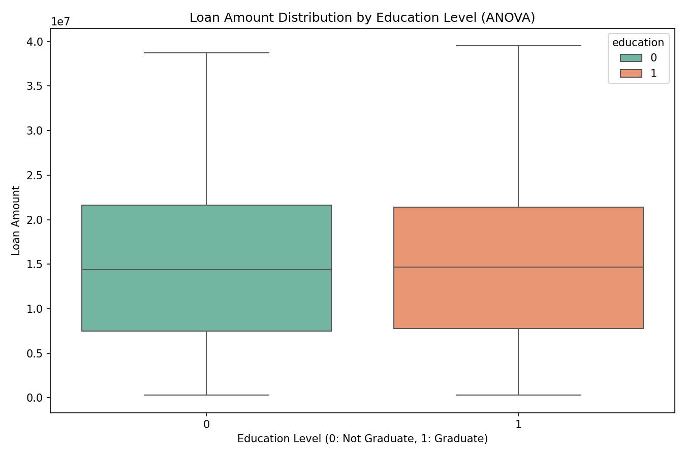
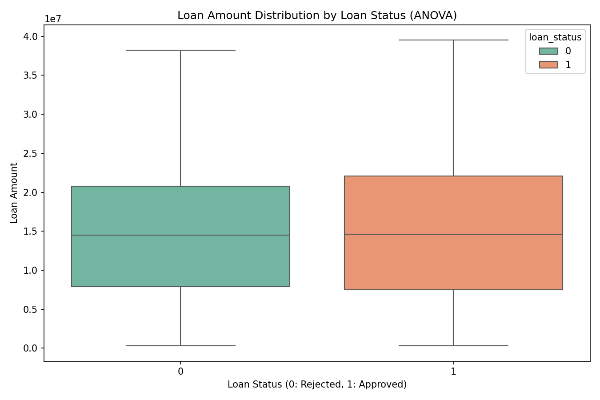

<div align="center">
  <h1>🏦 Phân Tích & Dự Đoán Phê Duyệt Khoản Vay</h1>
  <p><strong>Loan Approval Classification — Machine Learning Project</strong></p>
  <p>
    
    
    
    
    
    
  </p>
</div>

---

## 📋 Mục Lục

- [1. Tổng Quan Dự Án](#1-tổng-quan-dự-án)
- [2. Bộ Dữ Liệu](#2-bộ-dữ-liệu)
- [3. Phân Tích Khám Phá (EDA)](#3-phân-tích-khám-phá-eda)
- [4. Kỹ Thuật Đặc Trưng (Feature Engineering)](#4-kỹ-thuật-đặc-trưng-feature-engineering)
- [5. Xây Dựng & Đánh Giá Mô Hình](#5-xây-dựng--đánh-giá-mô-hình)
- [6. So Sánh Hiệu Năng Mô Hình](#6-so-sánh-hiệu-năng-mô-hình)
- [7. Phân Tích Feature Importance](#7-phân-tích-feature-importance)
- [8. Kiểm Định Thống Kê](#8-kiểm-định-thống-kê)
- [9. Kết Luận & Khuyến Nghị](#9-kết-luận--khuyến-nghị)
- [10. Hướng Dẫn Sử Dụng](#10-hướng-dẫn-sử-dụng)
- [11. Cấu Trúc Thư Mục](#11-cấu-trúc-thư-mục)
- [12. Công Nghệ Sử Dụng](#12-công-nghệ-sử-dụng)

---

## 1. Tổng Quan Dự Án

### 🎯 Mục Tiêu

Xây dựng mô hình **phân loại (classification)** để dự đoán khả năng **phê duyệt khoản vay** (`loan_status`: Approved / Rejected) dựa trên thông tin nhân khẩu học, điểm tín dụng và tài sản thế chấp của người vay.

### 📊 Kết Quả Tốt Nhất

| Chỉ Số | Giá Trị |
|--------|:-------:|
| **Mô hình** | Random Forest đã tối ưu (Tuned) |
| **Accuracy** | **97.42%** |
| **ROC AUC** | **0.9984** |
| **Log Loss** | **0.0573** |
| **F1 Score** | **0.9790** |

> ✅ Mô hình đạt hiệu suất gần như hoàn hảo với khả năng khái quát hóa xuất sắc (chênh lệch train/test chỉ **0.10%**).

### 🔍 Insight Chính

- 🏆 **Điểm CIBIL** (`cibil_score`) là yếu tố quyết định áp đảo với **91.32%** tầm quan trọng
- ❌ **Trình độ học vấn** và **Tình trạng tự kinh doanh** **KHÔNG** có ảnh hưởng thống kê đến kết quả phê duyệt (xác nhận bởi Chi-Square & ANOVA)
- ❌ **Trình độ học vấn** cũng **KHÔNG** ảnh hưởng đến số tiền vay (ANOVA: p = 0.487)
- 📈 Mô hình Random Forest sau tuning đã giải quyết hoàn toàn vấn đề overfitting

---

## 2. Bộ Dữ Liệu

### 2.1. Tổng Quan Dữ Liệu

| Thuộc Tính | Giá Trị |
|------------|:-------:|
| Số bản ghi | **4,269** |
| Số đặc trưng gốc | **12** |
| Số đặc trưng sau FE | **17** |
| Biến mục tiêu | `loan_status` (Approved / Rejected) |
| Tỷ lệ target | **Approved: 62.2%** — **Rejected: 37.8%** |
| Nguồn dữ liệu | [Kaggle — Loan Approval Prediction](https://www.kaggle.com/datasets/) |

### 2.2. Bảng Mô Tả Biến

| # | Biến | Kiểu | Mô Tả |
|:---:|------|:----:|-------|
| 1 | `loan_id` | int | Mã định danh khoản vay |
| 2 | `no_of_dependents` | int | Số người phụ thuộc |
| 3 | `education` | cat | Trình độ học vấn (Graduate / Not Graduate) |
| 4 | `self_employed` | cat | Tự kinh doanh (Yes / No) |
| 5 | `income_annum` | int | Thu nhập hàng năm |
| 6 | `loan_amount` | int | Số tiền vay yêu cầu |
| 7 | `loan_term` | int | Thời hạn vay (năm) |
| 8 | `cibil_score` | int | Điểm tín dụng CIBIL (300–900) |
| 9 | `residential_assets_value` | int | Giá trị tài sản nhà ở |
| 10 | `commercial_assets_value` | int | Giá trị tài sản thương mại |
| 11 | `luxury_assets_value` | int | Giá trị tài sản xa xỉ |
| 12 | `bank_asset_value` | int | Tài sản ngân hàng / đầu tư |
| **13** | **`loan_status`** | **cat** | **Trạng thái phê duyệt (Target)** |

### 2.3. Phân Phối Dữ Liệu

<table>
  <tr>
    <td></td>
    <td></td>
  </tr>
  <tr>
    <td align="center"><em>Phân phối Loan Status</em></td>
    <td align="center"><em>Phân phối CIBIL Score</em></td>
  </tr>
  <tr>
    <td></td>
    <td></td>
  </tr>
  <tr>
    <td align="center"><em>Phân phối thu nhập</em></td>
    <td align="center"><em>Phân phối số tiền vay</em></td>
  </tr>
  <tr>
    <td></td>
    <td></td>
  </tr>
  <tr>
    <td align="center"><em>Phân phối thời hạn vay</em></td>
    <td align="center"><em>Phân phối số người phụ thuộc</em></td>
  </tr>
  <tr>
    <td></td>
    <td></td>
  </tr>
  <tr>
    <td align="center"><em>Phân phối trình độ học vấn</em></td>
    <td align="center"><em>Phân phối tình trạng tự KD</em></td>
  </tr>
</table>

<table>
  <tr>
    <td></td>
    <td></td>
  </tr>
  <tr>
    <td align="center"><em>Tài sản nhà ở</em></td>
    <td align="center"><em>Tài sản thương mại</em></td>
  </tr>
  <tr>
    <td></td>
    <td></td>
  </tr>
  <tr>
    <td align="center"><em>Tài sản xa xỉ</em></td>
    <td align="center"><em>Tài sản ngân hàng</em></td>
  </tr>
</table>

---

## 3. Phân Tích Khám Phá (EDA)

### 3.1. Thống Kê Mô Tả

Dữ liệu sau khi làm sạch bao gồm **4,269 bản ghi** với giá trị trung bình:

| Biến | Trung bình | Min | Max |
|------|:----------:|:---:|:---:|
| Thu nhập năm | ~7.6M | ~200K | ~99M |
| Số tiền vay | ~25.9M | ~500K | ~99M |
| Điểm CIBIL | ~574 | 300 | 900 |
| Thời hạn vay | ~12.2 năm | 2 năm | 20 năm |
| Tổng tài sản | ~48.7M | ~100K | ~99M+ |

### 3.2. Phân Tích Tương Quan Pearson

Phân tích tương quan được thực hiện trên hai cặp biến số chính:

#### Thu nhập vs Số tiền vay


> **Nhận xét:** Mối tương quan giữa thu nhập và số tiền vay không quá mạnh, cho thấy người vay không nhất thiết chỉ vay dựa trên thu nhập. Có sự phân tán rộng ở các mức thu nhập khác nhau.

#### Tổng tài sản vs Tài sản ngân hàng


> **Nhận xét:** Tổng tài sản và tài sản ngân hàng có tương quan tuyến tính rõ rệt. Đây là cơ sở để xem xét loại bỏ các đặc trưng chồng chéo.

---

## 4. Kỹ Thuật Đặc Trưng (Feature Engineering)

### 4.1. Đặc Trưng Mới Được Tạo

Từ 12 đặc trưng gốc, **5 đặc trưng mới** được xây dựng nhằm tăng cường khả năng dự đoán:

| # | Đặc Trưng | Công Thức | Ý Nghĩa |
|:---:|-----------|:----------:|---------|
| 1 | `total_assets_value` | `residential + commercial + luxury + bank` | Tổng giá trị tài sản ròng |
| 2 | `loan_to_income_ratio` | `loan_amount / income_annum` | Tỷ lệ nợ trên thu nhập (DTI) — đo khả năng trả nợ |
| 3 | `assets_to_loan_ratio` | `total_assets / loan_amount` | Tỷ lệ tài sản đảm bảo trên khoản vay |
| 4 | `income_per_dependent` | `income_annum / no_of_dependents` | Thu nhập bình quân đầu người phụ thuộc |
| 5 | `loan_per_term` | `loan_amount / loan_term` | Áp lực trả nợ hàng năm |

### 4.2. Xử Lý Biến Phân Loại

- **Label Encoding** cho 2 biến categorical:
  - `education`: Not Graduate → 0, Graduate → 1
  - `self_employed`: No → 0, Yes → 1

### 4.3. Phân Phối Đặc Trưng Mới


> Phân phối tổng tài sản cho thấy phần lớn người vay có tổng tài sản tập trung ở mức thấp, với một số ít outlier ở mức rất cao.

---

## 5. Xây Dựng & Đánh Giá Mô Hình

### 5.1. Quy Trình Huấn Luyện

Dự án sử dụng **3 mô hình** được xây dựng qua **2 giai đoạn**:

```
Giai đoạn 1: Huấn luyện Baseline
├── Logistic Regression (baseline đơn giản)
└── Random Forest (baseline — phát hiện overfitting)

Giai đoạn 2: Tối ưu hóa
├── Loại bỏ 5 đặc trưng có nguy cơ data leakage cao
├── GridSearchCV với 3-fold cross-validation
└── Random Forest Tuned (mô hình tốt nhất)
```

### 5.2. Xử Lý Overfitting

**Vấn đề phát hiện:** Mô hình Random Forest baseline bị overfitting nghiêm trọng (train ~100%, test ~99.77%).

**Giải pháp:**
1. 🚫 **Loại bỏ 5 đặc trưng** có nguy cơ **data leakage**:
   - `total_assets_value` — tổng hợp từ các biến tài sản khác
   - `loan_to_income_ratio` — quan hệ tuyến tính với `loan_amount` và `income_annum`
   - `assets_to_loan_ratio` — quan hệ tuyến tính với tổng tài sản và số tiền vay
   - `income_per_dependent` — suy ra trực tiếp từ `income_annum` và `no_of_dependents`
   - `loan_per_term` — quan hệ tuyến tính với `loan_amount` và `loan_term`

2. ⚙️ **Tuning hyperparameters** với GridSearchCV:
   - Giới hạn `max_depth=6` — ngăn cây quá sâu
   - Tăng `min_samples_split=15`, `min_samples_leaf=8` — yêu cầu số lượng mẫu tối thiểu
   - Giảm `max_features=0.6` — chỉ dùng 60% đặc trưng mỗi cây
   - Cân bằng lớp với `class_weight='balanced'`

**Kết quả:** Chênh lệch train/test giảm từ **~0.23% → 0.10%** (gần như không còn overfitting).

### 5.3. Thông Số Tối Ưu (Best Parameters)

| Tham Số | Giá Trị |
|---------|:-------:|
| `n_estimators` | 150 |
| `max_depth` | 6 |
| `max_features` | 0.6 |
| `min_samples_split` | 15 |
| `min_samples_leaf` | 8 |
| `class_weight` | 'balanced' |

---

## 6. So Sánh Hiệu Năng Mô Hình

### 6.1. Bảng So Sánh Tổng Quan

| Mô Hình | Accuracy | Precision | Recall | F1 Score | ROC AUC | Log Loss |
|---------|:--------:|:---------:|:------:|:--------:|:-------:|:--------:|
| **Logistic Regression** | 0.9251 | 0.9332 | 0.9473 | 0.9402 | 0.9789 | 0.1833 |
| **RF Baseline** | 0.9688 | 0.9961 | 0.9536 | 0.9744 | 0.9982 | 0.1314 |
| **RF Tuned (Best) ⭐** | **0.9742** | **0.9935** | **0.9649** | **0.9790** | **0.9984** | **0.0573** |

### 6.2. Phân Tích Chi Tiết Từng Mô Hình

#### 📊 Logistic Regression (Baseline)

| Chỉ số | Giá trị |
|--------|:-------:|
| Train Accuracy | 92.80% |
| Test Accuracy | 92.51% |
| CV Mean (5-fold) | 92.76% |
| Train/Test Gap | -0.29% |

- **Ưu điểm:** Đơn giản, dễ diễn giải, không overfitting
- **Nhược điểm:** Độ chính xác thấp nhất trong 3 mô hình
- **Phù hợp:** Khi cần mô hình interpretable và nhanh

#### 🌲 Random Forest Baseline

| Chỉ số | Giá trị |
|--------|:-------:|
| Train Accuracy | 96.39% |
| Test Accuracy | 96.88% |
| CV Mean (5-fold) | 95.95% |
| Train/Test Gap | -0.49% |

- **Tham số:** `n_estimators=100, max_depth=6, min_samples_split=15, min_samples_leaf=8`
- Overfitting nhẹ được kiểm soát tốt nhờ giới hạn độ sâu

#### 🏆 Random Forest Tuned (Best Model)

| Chỉ số | Giá trị |
|--------|:-------:|
| Train Accuracy | 97.32% |
| Test Accuracy | **97.42%** |
| CV Mean (5-fold) | 96.45% |
| Best CV Score (GridSearch) | 96.75% |
| Train/Test Gap | **0.10%** |

- **Chênh lệch train/test cực thấp** — khả năng khái quát hóa xuất sắc
- Mô hình được chọn làm **final model** cho toàn bộ dự án

### 6.3. Ma Trận Nhầm Lẫn (Confusion Matrix)


| | Dự đoán: Rejected | Dự đoán: Approved |
|---|---|---|
| **Thực tế: Rejected** | **481 (TN)** ✅ | 3 (FP) ❌ |
| **Thực tế: Approved** | 30 (FN) ❌ | **767 (TP)** ✅ |

**Phân tích chi tiết:**

| Chỉ Số | Công Thức | Giá Trị | Đánh Giá |
|--------|:----------:|:-------:|:--------:|
| **Sensitivity (Recall)** | TP / (TP + FN) | **96.2%** | 🟢 Rất tốt |
| **Specificity** | TN / (TN + FP) | **99.4%** | 🟢 Xuất sắc |
| **False Positive Rate** | FP / (FP + TN) | **0.6%** | 🟢 Rất thấp |
| **False Negative Rate** | FN / (FN + TP) | **3.8%** | 🟡 Chấp nhận được |
| **Precision** | TP / (TP + FP) | **99.4%** | 🟢 Xuất sắc |
| **Negative Predictive Value** | TN / (TN + FN) | **94.1%** | 🟢 Tốt |

> **Diễn giải:** Mô hình đặc biệt xuất sắc trong việc xác định các khoản vay **bị từ chối** (Specificity 99.4%), với chỉ **3 trường hợp dương tính giả**. Tỷ lệ bỏ sót các khoản vay đáng được phê duyệt là 3.8% (30 false negative), ở mức chấp nhận được.

### 6.4. Đường Cong ROC


| Chỉ số | Giá trị |
|--------|:-------:|
| **AUC (Area Under Curve)** | **0.9984** |
| Gần tiệm cận (1,1) | ✅ |

> **Ý nghĩa:** AUC = 0.9984 cho thấy mô hình có khả năng **phân tách gần như hoàn hảo** giữa hai lớp Approved và Rejected. Đường cong ROC tiến sát góc trên bên trái, khẳng định tỷ lệ True Positive Rate rất cao với False Positive Rate rất thấp ở mọi ngưỡng.

---

## 7. Phân Tích Feature Importance

### 7.1. Mức Độ Quan Trọng của Các Đặc Trưng


| # | Đặc Trưng | Importance | Tích Lũy | Đánh Giá |
|:---:|-----------|:----------:|:--------:|:--------:|
| 1 | **`cibil_score`** | **91.32%** | 91.32% | 🟢 Quyết định |
| 2 | `loan_term` | 4.65% | 95.97% | 🟢 Quan trọng |
| 3 | `loan_amount` | 1.71% | 97.68% | 🟡 Trung bình |
| 4 | `income_annum` | 0.73% | 98.41% | 🟡 Trung bình |
| 5 | `luxury_assets_value` | 0.44% | 98.85% | 🔵 Thấp |
| 6 | `commercial_assets_value` | 0.38% | 99.23% | 🔵 Thấp |
| 7 | `residential_assets_value` | 0.34% | 99.57% | 🔵 Thấp |
| 8 | `bank_asset_value` | 0.25% | 99.82% | 🔵 Thấp |
| 9 | `no_of_dependents` | 0.11% | 99.93% | ⚪ Rất thấp |
| 10 | `self_employed` | 0.04% | 99.97% | ⚪ Không đáng kể |
| 11 | `education` | ~0.00% | ~100% | ⚪ Không ảnh hưởng |

### 7.2. Insight Chiến Lược

```
                    Feature Importance Distribution
                    
    cibil_score ■■■■■■■■■■■■■■■■■■■■■■■■■■■■■■■■■■■■■■ 91.32%
    loan_term   ■■                                        4.65%
    loan_amount ▊                                        1.71%
    income      ▎                                        0.73%
    (others)    ▏                                        1.59%
    ───────────────────────────────────────────────────────
                 0%        25%        50%        75%       100%
```

> 🏆 **Điểm CIBIL chiếm 91.32%** tổng tầm quan trọng — đây là yếu tố **duy nhất quyết định** kết quả phê duyệt khoản vay. Các yếu tố nhân khẩu học như trình độ học vấn và tình trạng tự kinh doanh gần như **không có tác động** đến quyết định phê duyệt.

---

## 8. Kiểm Định Thống Kê

### 8.1. Chi-Square Test (Mối Quan Hệ Giữa Biến Phân Loại)

#### Education vs Loan Status

| Chỉ số | Giá trị |
|--------|:-------:|
| Chi-Square Statistic | ~0.084 |
| **p-value** | **0.772** |
| Kết luận | ❌ **Không có mối quan hệ** |


#### Self-Employed vs Loan Status

| Chỉ số | Giá trị |
|--------|:-------:|
| Chi-Square Statistic | ~0.000 |
| **p-value** | **1.000** |
| Kết luận | ❌ **Không có mối quan hệ** |


> **Kết luận thống kê:** Với p-value >> 0.05 ở cả hai phép kiểm định, chúng ta **không thể bác bỏ giả thuyết H₀** — không có bằng chứng cho thấy `education` hay `self_employed` ảnh hưởng đến `loan_status`. Kết quả này **hoàn toàn nhất quán** với phân tích Feature Importance ở trên.

### 8.2. ANOVA (Phân Tích Phương Sai)

#### Education vs Loan Amount

| Chỉ số | Giá trị |
|--------|:-------:|
| F-statistic | 0.4823 |
| **p-value** | **0.487** |
| Kết luận | ❌ **Không có sự khác biệt** |



> **Kết luận thống kê:** Với p-value = 0.487 >> 0.05, **không có bằng chứng thống kê** để kết luận rằng trình độ học vấn ảnh hưởng đến số tiền vay. Số tiền vay trung bình giữa nhóm Graduate và Not Graduate là tương đương nhau.

#### Loan Status vs Loan Amount

| Chỉ số | Giá trị |
|--------|:-------:|
| F-statistic | 1.113 |
| **p-value** | **0.291** |
| Kết luận | ❌ **Không có sự khác biệt** |



> **Kết luận thống kê:** Với p-value = 0.291 > 0.05, **không có sự khác biệt có ý nghĩa thống kê** về số tiền vay giữa nhóm được phê duyệt và bị từ chối. Số tiền vay không phải yếu tố quyết định — `cibil_score` mới là yếu tố chi phối.

### 8.3. So Sánh Các Phát Hiện

| Phương Pháp | Education | Self-Employed | Education → Loan Amount | Loan Status → Loan Amount |
|-------------|:---------:|:-------------:|:-----------------------:|:-------------------------:|
| Feature Importance (RF) | ~0.00% | 0.04% | — | — |
| Chi-Square Test | p = 0.772 | p = 1.000 | — | — |
| ANOVA (F-test) | — | — | p = 0.487 | p = 0.291 |
| **Kết luận chung** | **Không ảnh hưởng** | **Không ảnh hưởng** | **Không ảnh hưởng** | **Không ảnh hưởng** |

---

## 9. Kết Luận & Khuyến Nghị

### 🏆 Kết Luận

1. **Mô hình tối ưu:** Random Forest Tuned đạt **Accuracy 97.42%** và **ROC AUC 0.9984** — khả năng dự đoán gần như hoàn hảo.
2. **Yếu tố quyết định:** `cibil_score` (điểm tín dụng) chiếm **91.32%** tầm quan trọng, là yếu tố áp đảo trong quyết định phê duyệt khoản vay.
3. **Yếu tố không ảnh hưởng:** Trình độ học vấn, tình trạng tự kinh doanh và **trạng thái phê duyệt** **KHÔNG** có ý nghĩa thống kê với số tiền vay — được xác nhận bởi Feature Importance, Chi-Square test và ANOVA (Education → Loan Amount: p = 0.487; Loan Status → Loan Amount: p = 0.291).
4. **Overfitting được kiểm soát:** Sau khi loại bỏ 5 đặc trưng data leakage và tinh chỉnh hyperparameter, chênh lệch train/test chỉ còn **0.10%**.

### 💡 Khuyến Nghị Kinh Doanh

| Đối Tượng | Khuyến Nghị |
|-----------|-------------|
| **Ngân hàng / Tổ chức tín dụng** | Tập trung đánh giá **điểm CIBIL** làm tiêu chí hàng đầu; đơn giản hóa quy trình thẩm định các yếu tố nhân khẩu học không cần thiết |
| **Người vay** | Cải thiện điểm tín dụng CIBIL là cách hiệu quả nhất để tăng khả năng được phê duyệt; thời hạn vay và số tiền vay cũng cần được cân nhắc hợp lý |
| **Phân tích rủi ro** | Sử dụng mô hình RF Tuned để hỗ trợ ra quyết định, kết hợp với ngưỡng xác suất linh hoạt tùy theo chính sách rủi ro của từng tổ chức |

### 🚀 Hướng Phát Triển

- [ ] Thử nghiệm các thuật toán nâng cao: **XGBoost, LightGBM, CatBoost**
- [ ] Cân nhắc sử dụng **kỹ thuật oversampling (SMOTE)** để xử lý mất cân bằng lớp
- [ ] Xây dựng **API endpoint** cho mô hình (FastAPI / Flask) để phục vụ real-time inference
- [ ] Tích hợp **Power BI dashboard** (`reports/dashboard/loan-approval.pbix`) để trực quan hóa kết quả
- [ ] Thu thập thêm dữ liệu về lịch sử trả nợ, mục đích vay để cải thiện độ chính xác

---

## 10. Hướng Dẫn Sử Dụng

### Yêu Cầu Hệ Thống

- Python **3.8+**
- Các thư viện được liệt kê trong `requirements.txt`

### Cài Đặt

```bash
# Clone repository
git clone https://github.com/your-username/Loan_Approval_Classification_Dataset.git
cd Loan_Approval_Classification_Dataset

# Cài đặt dependencies
pip install -r requirements.txt
```

### Chạy Notebooks

```bash
# Khởi chạy Jupyter
jupyter notebook

# Hoặc mở bằng VS Code
code .
```

### Thứ Tự Chạy Khuyến Nghị

| Bước | Notebook | Mô Tả |
|:----:|----------|-------|
| 1 | `01_infomation_data.ipynb` | Tổng quan dữ liệu, thống kê mô tả |
| 2 | `02_eda.ipynb` | Phân tích khám phá, kiểm định giả thuyết |
| 3 | `03_feature_engineering.ipynb` | Tạo đặc trưng mới |
| 4 | `04_train_models.ipynb` | Huấn luyện mô hình baseline |
| 5 | `05_hyperparameter_tuning.ipynb` | Tối ưu hóa siêu tham số |
| 6 | `06_pearson.ipynb` | Phân tích tương quan Pearson |
| 7 | `07_chi_square.ipynb` | Kiểm định Chi-Square |
| 8 | `08_anova.ipynb` | Phân tích phương sai (ANOVA) |

---

## 11. Cấu Trúc Thư Mục

```
Loan_Approval_Classification_Dataset/
│
├── data/                          # Dữ liệu
│   ├── raw/                       # Dữ liệu gốc
│   ├── process/                   # Dữ liệu đã làm sạch
│   └── external/                  # Dữ liệu bên ngoài
│
├── notebooks/                     # 8 Jupyter Notebooks
│   ├── 01_infomation_data.ipynb
│   ├── 02_eda.ipynb
│   ├── 03_feature_engineering.ipynb
│   ├── 04_train_models.ipynb
│   ├── 05_hyperparameter_tuning.ipynb
│   ├── 06_pearson.ipynb
│   ├── 07_chi_square.ipynb
│   ├── 08_anova.ipynb
│   └── codebook.md
│
├── models/                        # Mô hình đã huấn luyện
│   ├── logistic_regression_baseline.pkl
│   ├── random_forest_best_fixed.pkl
│   ├── feature_names_fixed.pkl
│   └── feature_columns.pkl
│
├── reports/                       # Báo cáo
│   ├── images/                    # Biểu đồ phân tích
│   │   ├── information_data/
│   │   ├── feature_engineering/
│   │   ├── pearson/
│   │   ├── chi_square/
│   │   ├── anova/
│   │   └── train_models/
│   ├── dashboard/                 # Power BI Dashboard
│   │   └── loan-approval.pbix
│   └── bao_cao.docx               # Báo cáo Word
│
├── documents/                     # Tài liệu tham khảo
├── confusion_matrix_fixed.png     # Ma trận nhầm lẫn
├── roc_curve_fixed.png            # Đường cong ROC
├── requirements.txt               # Dependencies
├── README.md                      # README (Tiếng Việt)
└── README.en.md                   # README (English)
```

---

## 12. Công Nghệ Sử Dụng

<div align="center">
  <table>
    <tr>
      <td align="center"><b>Ngôn ngữ & Thư viện</b></td>
      <td align="center"><b>Mô hình & Công cụ</b></td>
      <td align="center"><b>Trực quan hóa</b></td>
    </tr>
    <tr>
      <td>
        • Python 3.8+<br>
        • pandas — Xử lý dữ liệu<br>
        • numpy — Tính toán số học<br>
        • scikit-learn — Machine Learning<br>
        • scipy — Thống kê
      </td>
      <td>
        • Logistic Regression<br>
        • Random Forest Classifier<br>
        • GridSearchCV — Tuning<br>
        • joblib — Serialization<br>
        • statsmodels — Thống kê nâng cao
      </td>
      <td>
        • matplotlib — Đồ thị cơ bản<br>
        • seaborn — Đồ thị nâng cao<br>
        • plotly — Đồ thị tương tác<br>
        • Power BI — Dashboard
      </td>
    </tr>
  </table>
</div>

---

<div align="center">
  <p>
    <strong>📝 Báo cáo chi tiết:</strong> <a href="reports/bao_cao.docx">bao_cao.docx</a> |
    <strong>📊 Dashboard:</strong> <a href="reports/dashboard/loan-approval.pbix">Power BI</a> |
    <strong>🧹 Dữ liệu sạch:</strong> <a href="https://github.com/X6K18/loan-approval-cleaned-dataset">github.com/X6K18/loan-approval-cleaned-dataset</a>
  </p>
  <p>
    <em>Dự án được thực hiện trong khuôn khổ môn học — Phân tích dữ liệu & Machine Learning</em>
  </p>
  <p>
    <a href="#">⬆ Lên đầu trang</a>
  </p>
</div>
